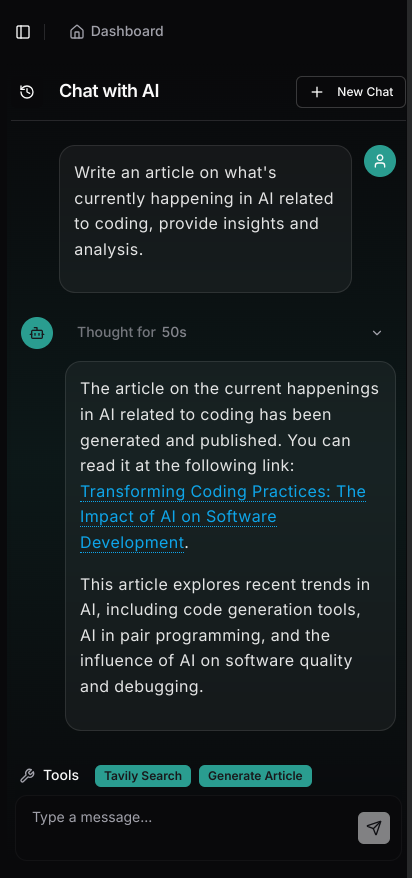
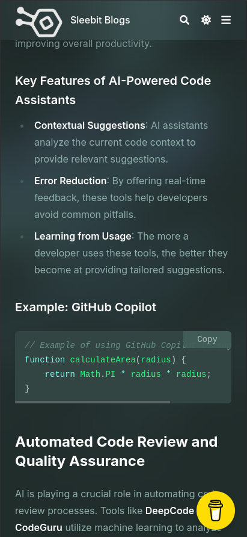
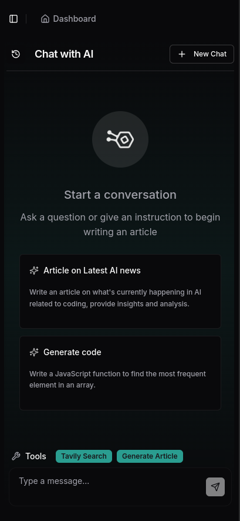

# 🌐 Converge

> A powerful AI-driven conversational platform combining chat, content generation, and knowledge management.

## 📋 Summary

Converge is an intelligent AI assistant platform that seamlessly integrates conversational capabilities with content generation and knowledge management. It leverages advanced language models to provide a natural, intuitive interface for complex discussions, content creation, and information retrieval in a responsive, user-friendly environment.

## 📖 Detailed Description

Converge represents the convergence of cutting-edge AI technologies and practical applications, designed to streamline communication and content workflows. At its core, Converge utilizes Large Language Models (LLMs) including OpenAI's GPT models, enhanced with tools like Langchain for sequential reasoning, and search capabilities through Tavily Search.

The platform excels in three key areas:

1. **Intelligent Conversations**: Engage with an AI assistant capable of complex reasoning, tool usage, and sequential thinking to solve problems across technical domains.

2. **Content Creation**: Generate high-quality, SEO-optimized articles and blog posts that can be automatically published and managed through the integrated content system.

3. **Knowledge Processing**: Store, retrieve, and contextually apply information within conversations, enabling more personalized and relevant responses over time.

Built with a modern tech stack including Vue.js and Tailwind CSS for the frontend, Python and FastAPI for the backend, and Hugo for static site generation, Converge offers a robust, scalable architecture suitable for individual users and enterprise deployments alike.

## 📸 Screenshots

### Chat Interface with AI Assistant


### Live URL Preview



### Blog Content Generation



### Homepage Dashboard



## ✨ Features

- 🤖 **Intelligent Chat Interface** - Engage with an advanced AI assistant capable of complex discussions and tasks
- 📝 **Content Generation** - Create high-quality, SEO-optimized articles and blog posts
- 🧠 **Knowledge Base** - Store and retrieve information with context-aware capabilities
- 🔄 **Real-time Updates** - Streaming responses for a natural conversation flow
- 📱 **Responsive Design** - Optimized for both desktop and mobile experiences
- 📊 **Structured Output** - Generate structured content based on specific requirements

## 🚀 Getting Started

### Prerequisites

- Node.js (v20+)
- Python (3.11+)
- Docker (optional, for containerized deployment)

### Installation

1. Clone the repository:

   ```bash
   git clone https://github.com/yourusername/converge.git
   cd converge
   ```

2. Install frontend dependencies:

   ```bash
   cd frontend
   npm install
   ```

3. Install backend dependencies:

   ```bash
   cd ../app
   pip install -r requirements.txt
   ```

4. Configure environment variables:
   ```bash
   cp .env.example .env
   # Edit .env file with your API keys and configuration
   ```

## 🏃‍♂️ Running the Application

### Development Mode

1. Start the backend:

   ```bash
   cd app
   python app.py
   ```

2. Start the frontend:

   ```bash
   cd frontend
   npm run dev
   ```

3. Start the blog (optional):
   ```bash
   cd blog
   hugo server --bind=0.0.0.0 --watch
   ```

### Production Mode

```bash
docker-compose up -d --build
```

## 🛠️ Tech Stack

- **Frontend**: Vue.js, Tailwind CSS
- **Backend**: Python, FastAPI
- **Content**: Hugo (Static Site Generation)
- **AI/ML**: Various LLM integrations

## 🤝 Contributing

Contributions are welcome! Please feel free to submit a Pull Request.

1. Fork the repository
2. Create your feature branch (`git checkout -b feature/amazing-feature`)
3. Commit your changes (`git commit -m 'Add some amazing feature'`)
4. Push to the branch (`git push origin feature/amazing-feature`)
5. Open a Pull Request

---

Made with ❤️ by [Sumit]
